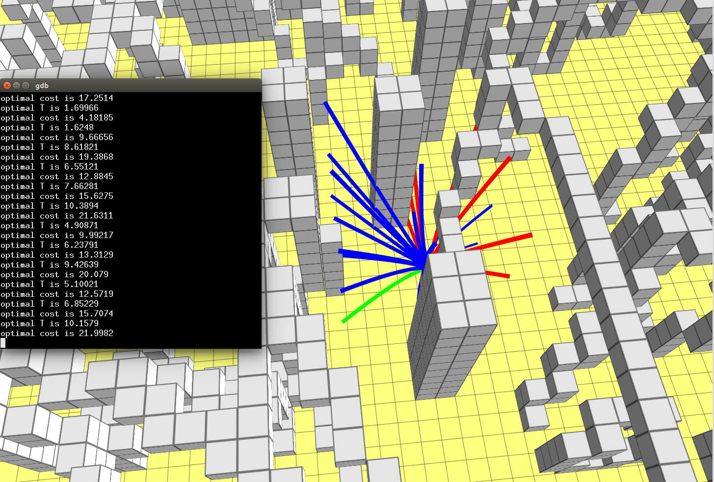

# 
Kinodynamic Path Finding

## Introduction
This report covers an assignment on an Local Lattice Planner on ROS with C++. At first, it solves an Optimal Boundary Value Problem (OBVP) and gets the optimal solution (control, state, and time) for partially free final state. After that, it builds an ego-graph of the linear modelled robot and selects the best trajectory with consideration of kinematic contrains.
## What is Kinodynamic 
The Kinodynamic planning problem is to synthesis a robot motion subject to simultaneous kinematic contrains, such as avoiding obstacles and dynamics contrains, such as modulus bounds on velocity, acceleration, and force. A kinodynamic solution is a mapping from time to generalized forces or accerations

## Why we need kinodynamic planning?
Straight-line connections between pairs of states are typically not valid trajectories due to the system's differential constrains. 

## Results

+ Blue curves represent solutions and the green one is the optimal solution.
+ Red cures represent invalid solution.

## TODO
#### Find polynomial roots from companion matrix eigenvalues
[Reference Paper](https://www.ams.org/journals/mcom/1995-64-210/S0025-5718-1995-1262279-2/S0025-5718-1995-1262279-2.pdf)
