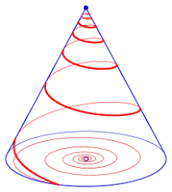
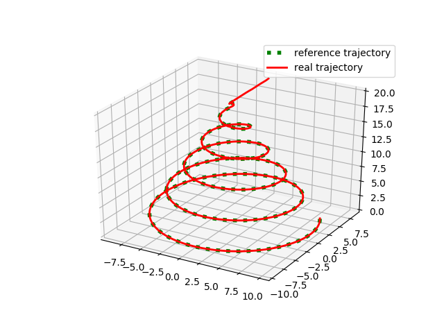

# <center>Motion Planning with Model Predictive Control</center>
## Introduction
In this project, a motion predictive controller is implemented in python and Matlab, to track concial spiral for a 3-axis triple integrator.

<p align="center">
  <b>Concial Spiral</b><br>
  
</p>

## Algorithm Overview
MPC uses a system model to predict the future states. Based on the prediction, MPC solves an online optimization algorithm to find the optimal control action that drives the predicted output to the reference. 

A model predictive controller needs:
* a dynamic model of the process to predict states
* an cost function J over a planning horizon to incorporate future reference information
* an optimization algorithm to compute the control input u by minimizing the cost function J 


## Implementation Details (Python)
The source-code files are located in the directory /python/, they are:
* get_PredictionMatrix.py: Computes matrixs of prediction model
```python
def getPredictionMatrix(K, dt, p_0, v_0, a_0):
  
    Tp = np.zeros([K, K])
    Tv = np.zeros([K, K])
    Ta = np.zeros([K, K])

    for i in range(K):
        Ta[i, :i] = np.ones([1, i]) * dt
        for j in range(i):
            Tv[i, j] = (i - j + 0.5) * dt ** 2
            Tp[i, j] = ((i - j + 1) * (i - j) / 2 + 1 / 6) * dt ** 3

    Ba = np.ones([K, 1]) * a_0
    Bv = np.ones([K, 1]) * v_0
    Bp = np.ones([K, 1]) * p_0
    for i in range(K):
        Bv[i] = Bv[i] + i * dt * a_0
        Bp[i] = Bp[i] + i * dt * v_0 + i ** 2 / 2 * a_0 * dt ** 2

    return Tp, Tv, Ta, Bp, Bv, Ba
```
* get_ReferenceTrajectory.py: Calculates a concial spiral as the tracking target. I duplicated the last reference points K times for the finaly MPC planning cycle.
```python
def get_ReferenceTrajectory(K,a,h,r,step_n):

    x = []
    y = []
    z = []
    c = 0

    verical = np.linspace(20, 0 , step_n);
    for t in verical:
        z.append(t)
        x.append((h - t)/h * r * cos(a * c * 0.2))
        y.append((h - t)/h * r * sin(a * c * 0.2))
        c = c+1
    ## duplicate the last reference point 
    for i in range(K):
        z.append(z[-1])
        x.append(x[-1])
        y.append(y[-1])

    return x, y, z
```
* mpc_solver.py: solves the constructed optimization problem by using OSQP library. To achieve this I divided mpc_solver into two parts.
  * First, I implemented discrete time model, setup constrains and defined objective function. So that the MPC problem is casted to a QP.
```python
for i in range(step_n-1):
        Tp, Tv, Ta, Bp, Bv, Ba = getPredictionMatrix(K, dt, p_0, v_0, a_0)

        Target_p_K = np.asarray(Target_p[count:count + K]).reshape(1, -1)

        H = scipy.linalg.block_diag(w4 * np.ones([K, K]) + w1 * (np.matmul(Tp.transpose(), Tp)),
                                    w5 * np.ones([K, K]))

        F = np.concatenate([2 * w1 * (np.matmul(Bp.transpose(), Tp) - np.matmul(Target_p_K, Tp)),
                            np.zeros([1, K])], axis=1)

        A = np.concatenate([conc_with_identity(Tv, 0),
                            conc_with_identity(-Tv, -1),
                            conc_with_identity(Ta, 0),
                            conc_with_identity(-Ta, -1),
                            conc_with_identity(np.ones([K, K]), 0),
                            conc_with_identity(-np.ones([K, K]), -1),
                            conc_with_identity(np.zeros_like(Ta), -1)], axis=0)

        b = np.concatenate([np.ones([K, 1]) * max_v - Bv,
                            -np.ones([K, 1]) * min_v + Bv,
                            np.ones([K, 1]) * max_a - Ba,
                            -np.ones([K, 1]) * min_a + Ba,
                            np.ones([K, 1]) * max_j,
                            -np.ones([K, 1]) * min_j,
                            np.zeros([K, 1])], axis=0)
```
  * Second, compressed sparse column matrix and solved the QP problem via OSQP 
```python
        P = sparse.csc_matrix(H)
        q = np.array(F.T)
        A_ = sparse.csc_matrix(A)
        l = np.array(-np.inf * np.ones_like(b))
        # l = None
        u = np.array(b)

        # Create an OSQP object
        prob = osqp.OSQP()

        # Setup workspace and change alpha parameter
        prob.setup(P, q, A_, l, u)

        # Solve problem
        res = prob.solve()

        j = res.x[0]
```
* main.py: runs this project and visualizes the result

## Experiment result
### Python Part
<p align="center">
  <b>Reference and Real Trajectory:</b><br>
  
</p>

<p align="center">
  <b>Visualization of States:</b><br>
  
</p>


<p align="center">
  <b>Result:</b><br>
</p>


|Method| Heuristic | Tie breaker | Visited nodes | Running time |
|:----:|:----:|:----:|:----:|:----:|
| A* | Manhattan | True  | 7341 | 2921ms |
| A* | Manhattan | False  |  7568 | 2941ms |
| A* | Euclidean | True | 5139 | 1540ms |
| A* | Euclidean | False | 6641 | 2441ms |
| A* | Euclidean | True and with large scale | 55 | 1.325ms |
| A* | Euclidean*2 | True  | 2540 | 320ms |
| A* | Euclidean*2 | False | 2639 | 384ms |
| A* | Diagonal | True  | 5660 | 1939ms |
| A* | Diagonal | False | 5984 | 1958ms |

## Implementation in MATLAB


