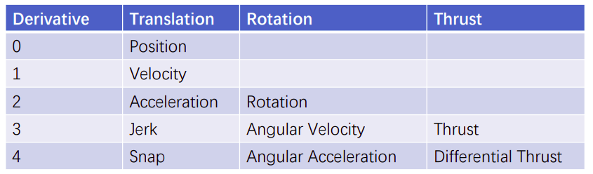

# 
Minimum snap trajectory generation

## Introduction
This report covers an assignment on the implementation of two methods for the minimum snap trajectory generator. The first method uses "quadprog QP" solver and the other one bases on the closed form solution.
## Smooth trajectory generation
The trajectory generation can be formed as an optimization problem.
+ Boundary condition: start, goal positions (orientations)
+ Intermediate condition: waypoint positions (orientations)
+ Waypoints can be found by path finding (A*, RRT, etc)
+ Smoothness criterions
  + Explicitly minimize certain derivatives in the space of flat outputs
    + Minimum jerk: minimize angular velocity, good for visual tracking
    + Minimum snap: minimize differential thrust, saves energy

## Results

+ Blue curves represent solutions and the green one is the optimal solution.
+ Red cures represent invalid solution.

