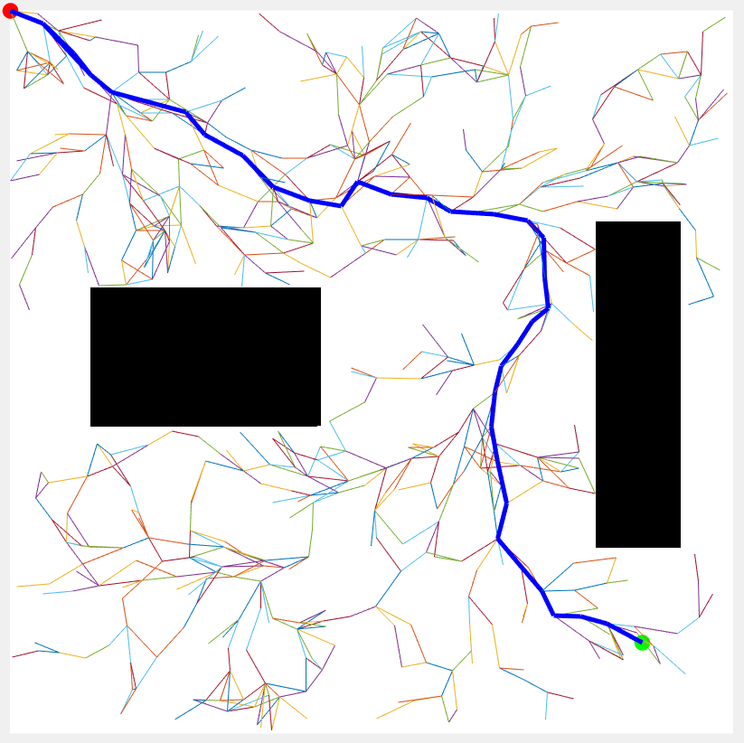
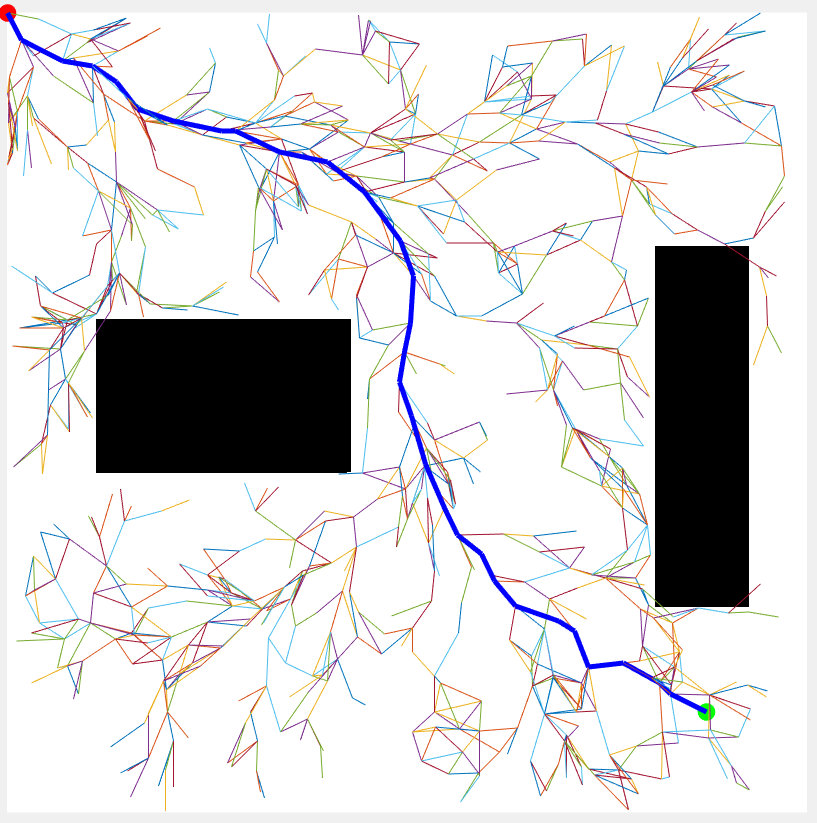
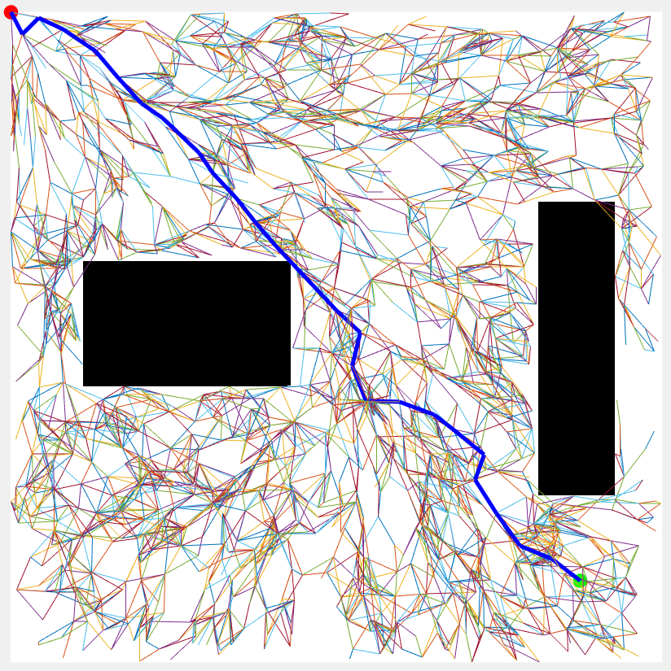
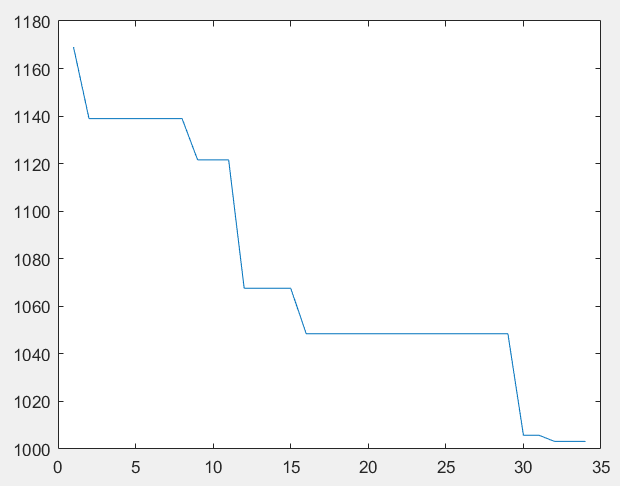
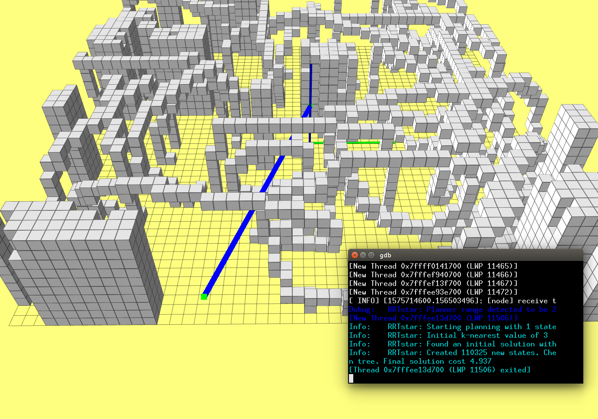

# <center>Sampling-Based Path Finding</center>
## Introduction
This report covers an implementing of the Rapidly-exploring random tree (RRT) algorithm on ROS with The Open Motion Planning Library (OMPL) and RRT* algorithm on MATLAB environment.

### Preliminaries Sampling Based-Planners

* Learning phase 
  * Sample N points in C-Space
  * Delete points that are not collision-free
  * Detect the C-Space with random points instead of explicitly construct the C-Space

* Query phase
  * Search on the road map to find a path, search-based path finding algorithms e.g. A* can be used
  * Simplified grid map is more efficient 

## Implementation in MATLAB 

#### RRT Algorithm Pipeline
+ Input Map, Xinit and Xgoal
+ Initialize Tree with Xinit
+ for i=1 to N do
  + Xrand <- Sample(M), randomly sample points in Map
  + Xnears <- Near(Xrand, T) find the nearest point to Xrand
  + Xnew <- Steer(Xrand, Xnear, StepSize), expand Xnew from Xrand to Xnear if the Xrand is far away from Xnear
  + Ei <- Edge(Xnew, Xnear), add Edge between Xnew and Xnear
  + If CollisionFree(M, Ei) then 
    + T.addNode(Xnew)
    + T.addEdge(Ei)
  + If ||Xnew-Xgoal|| < Threshold and CollisionFree(M, Edge(Xnew, Xgoal)) then 
  + end
+ End Loop

#### Extension of RRT
* Towards improving efficiency 
  * Find the nearest point with Kd-tree
* Towards path planning efficiency
  * Bidirectional RRT
* Towards improve the path quality
  * RRTstar

#### RRTstar Algorithm Pipeline
+ Input Map, Xinit and Xgoal
+ Initialize Tree with Xinit and path cost for each point
+ for i=1 to N do
  + Xrand <- Sample(M), randomly sample points in Map
  + Xnears <- Near(Xrand, T) find the nearst point to Xrand
  + Xnew <- Steer(Xrand, Xnear, StepSize), expand Xnew from Xrand to Xnear if the Xrand is far away from Xnear
  + Ei <- Edge(Xnew, Xnear), add Edge between Xnew and Xnear
  + If CollisionFree(M, Ei) then 
    + Xnears_ <- NearC(T, new), find near points of Xnew
    + Xmin <- ChooseParent(Xnears_, Xnew), find parent point from Xnears that Xnew has minimal path cost
    + T.addEdge(Xmin, Xnew)
    + T.rewire(), if Cost(Xnear) > Cost(Xnew) + dist(Xnew, Xnear) then
      + Parent(Xnear) = Xnew
+ End Loop

#### Result of RRTstar 

<p align="center">
  <b>Find a path:</b><br>
</p>


<p align="center">
  <b>Optimize the path:</b><br>
</p>


<p align="center">
  <b>Optimize the path with more samples:</b><br>
</p>


<p align="center">
  <b>Path cost is reduced after optimization:</b><br>
</p>



## Implementation in ROS
The Implementation of RRTstar on ROS is based on OMPL.

### Coding Details
* In the ROS environment we have cube collisions that are visualized as gray boxes. To reflect the environment, we use <code>ompl::base::RealVectorStateSpace</code> to represent state information like positions and define a state validity checker to check the collision
```c++
class ValidityChecker : public ob::StateValidityChecker
{
public:
    ValidityChecker(const ob::SpaceInformationPtr& si) :
        ob::StateValidityChecker(si) {}
    bool isValid(const ob::State* state) const
    {  
        const ob::RealVectorStateSpace::StateType* state3D =
            state->as<ob::RealVectorStateSpace::StateType>(); 
        double x = state3D->values[0];
        double y = state3D->values[1];
        double z = state3D->values[2];
        return _RRTstar_preparatory->isObsFree(x, y, z);
    }
};
```
* Then define state space, bounds, start and goal states in OMPL

```c++
ob::StateSpacePtr space(new ob::RealVectorStateSpace(3));

// Set the bounds of space to be in [0,1].
ob::RealVectorBounds bounds(3);
bounds.setLow(0, - _x_size * 0.5);
bounds.setLow(1, - _y_size * 0.5);
bounds.setLow(2, 0.0);

bounds.setHigh(0, + _x_size * 0.5);
bounds.setHigh(1, + _y_size * 0.5);
bounds.setHigh(2, _z_size);

space->as<ob::RealVectorStateSpace>()->setBounds(bounds);
// Construct a space information instance for this state space
ob::SpaceInformationPtr si(new ob::SpaceInformation(space));
// Set the object used to check which states in the space are valid
si->setStateValidityChecker(ob::StateValidityCheckerPtr(new ValidityChecker(si)));
si->setup();

// Set our robot's starting state
ob::ScopedState<> start(space);
start->as<ob::RealVectorStateSpace::StateType>()->values[0] = start_pt(0);
start->as<ob::RealVectorStateSpace::StateType>()->values[1] = start_pt(1);
start->as<ob::RealVectorStateSpace::StateType>()->values[2] = start_pt(2);

// Set our robot's goal state
ob::ScopedState<> goal(space);
goal->as<ob::RealVectorStateSpace::StateType>()->values[0] = target_pt(0);
goal->as<ob::RealVectorStateSpace::StateType>()->values[1] = target_pt(1);
goal->as<ob::RealVectorStateSpace::StateType>()->values[2] = target_pt(2);


ob::ProblemDefinitionPtr pdef(new ob::ProblemDefinition(si));
// Set the start and goal states
pdef->setStartAndGoalStates(start, goal);
```
* Next define an <code>omple::base::OptimizationObjective</code> for find an optimal path. Hier the PathLength is defined as optimization object
```c++
ob::OptimizationObjectivePtr getPathLengthObjective(const ob::SpaceInformationPtr& si)
{
    return ob::OptimizationObjectivePtr(new ob::PathLengthOptimizationObjective(si));
}
```
* Finaly OMPL will find a optimal path within a predefined planning time (10s)
```c++
  // Set the problem instance for our planner to solve
  optimizingPlanner->setProblemDefinition(pdef);
  optimizingPlanner->setup();
  // attempt to solve the planning problem within one second of
  // planning time
  ob::PlannerStatus solved = optimizingPlanner->solve(10.0);
```

<p align="center">
  <b>Result in ROS:</b><br>
</p>



