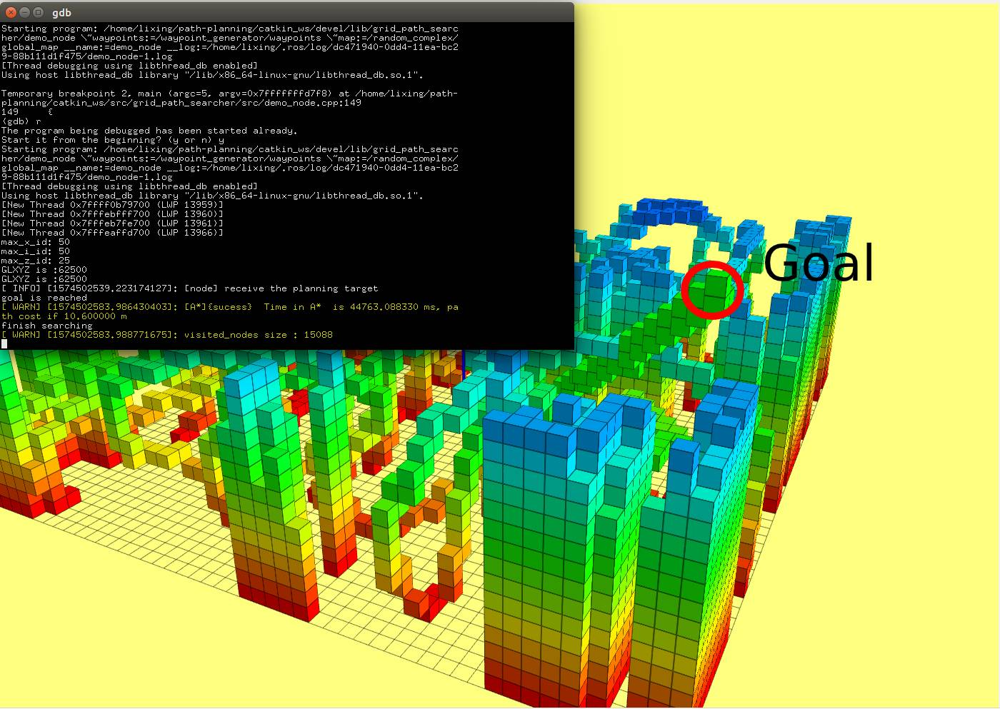
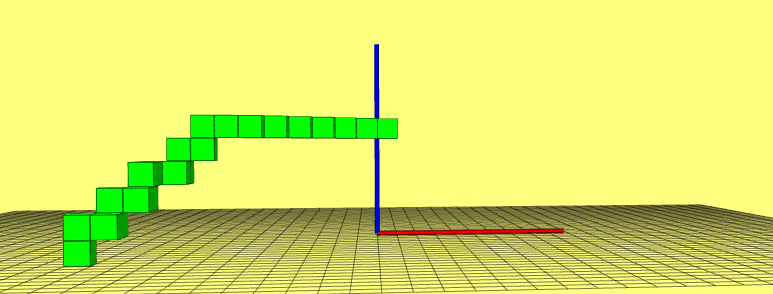

# <center>Motion Planning Assgiment 2</center>
## Introduction
This report covers an assignment on implementing A* algorithm on ROS and matlab environment. Different metrics and techniques are used to test the performance of the algorithm.
## Implementation 

#### Algorithm Pipeline
+ Maintain a openSet to store all the nodes to be expanded
+ the openSet is initialized with the start state Xs
+ Assgin g(Xs)=0, and g(n)=inifite for all other nodes in the graph
+ Loop
  + If openSet is empty, return FALSE; break
  + Remove the node "n" with the lowest f(n)=g(n)+h(n) from openSet
  + Mark node "n" as expanded
  + If the node "n" is the goal state, record the node as terminatePtr; break;
  + For all unexpanded neighbors "m" of node "n"
    + if g(m) = infinite ("m" is new discovered)
      + g(m) = g(n) + Cnm
      + Record the parent node of "m", m->cameFrom = n
      + Push node "m" into openSet
    + if g(m) > g(n) + Cnm
      + g(m) = g(n) + Cnm
      + m->cameFrom = n
      + m->f(n) = g(n) + h(m)
  + end
+ End Loo
+ Optimal paht can be found by recursively searching the parent node of terminatePtr

####Result in 3D Case

  

## Performance Analysis
I explored the influence of heuristic and tie-breaker to the performance of A* algorithm. I ran experiments in a non-obstacle environment for eliminating the bias caused by random maps. Wesee the quadratic of euclidean distance works better than other heuristics. The reason could be that the greediness of the heuristic determines the time consuming of the motion planning process, especially in a non-obstcale environment. what surprised me is the diagonal heuristic doesn't have a good performance as I expected. Probably i didn't implement a correct formulation of diagonal heuristic in the 3D case. And tie-breakder can slightly reduce the running time.

|Method| Heuristic | Tie breaker | Visited nodes | Running time |
|:----:|:----:|:----:|:----:|:----:|
| A* | Manhattan | True  | 7341 | 2921ms |
| A* | Manhattan | False  |  7568 | 2941ms |
| A* | Euclidean | True | 5139 | 1540ms |
| A* | Euclidean | False | 6641 | 2441ms |
| A* | Euclidean*2 | True  | 2540 | 320ms |
| A* | Euclidean*2 | False | 2639 | 384ms |
| A* | Diagonal | True  | 5660 | 1939ms |
| A* | Diagonal | False | 5984 | 1958ms |


```cpp
    ## Diagonal heuristic in 3D space
    if (dist_metric == 3){
        double dx = abs(poi_1(0) - poi_2(0));
        double dy = abs(poi_1(1) - poi_2(1));
        double dz = abs(poi_1(2) - poi_2(2));
        double dmin = min({dx, dy, dz});
        double dmax = max({dx, dy, dz});
        double dmid = dx + dy + dz - dmin - dmax;
        hue = (sqrt(3) - sqrt(2))*dmin + (sqrt(2) - 1)*dmid + dmax;
    }
```
