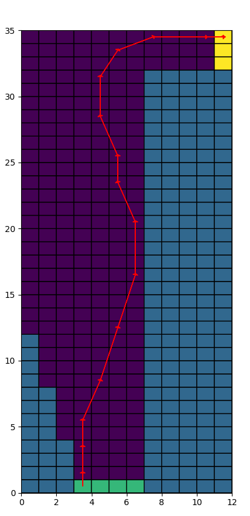

# <center>Uncertainties in Planning and MDP</center>
## 1. Introduction
This report covers an implementation of real-time dynamic programming to solve the Race Track problem with uncertainties. Since the heuristic evaluation function has a major influence on the performance, different heuristic evaluation functions are tested.
 
## 2. Fundational Concepts

#### 2.1 Planning with Uncertainties

* Introduce two  decision-makers to model the generation of uncertainties
  * Robot performans planning based on fully known states and perfect execution(model-based)
  * Nature adds uncertainties to the execution of plans made by robot, which is unpredictable to the robot.

#### 2.2 Dynamic Programming with Uncertainies
  * **Minimax Cost Planning**

  * **Expected Cost Planning**
    * Probabilistic model, a specific execution maybe not optimal
    * Expected-case analysis, require distribution of uncertainties


#### 2.3 Real-Time Dynamic Programming

The real-time dynamic programming(RTDP)[Barto et al., 1993] Algorithm is an asynchronous DP approach that updates sates encountered during heuristic-based MDP simulations. RTDP samples trajectories by greedy search and only those states will be updated.

One Key advantage of RTDP is that it may not need to explore all states and can focus on more relevant states.
  


## 3. Experiments

### 3.1 Problem Statements


### 3.2 Implementational Details

#### 3.2.1 Heuristic Functions
  * Scaled euclidean distance
    ```
    distance = np.linalg.norm(goal_position-current_position)
    g_value = distance/dist_factor
    ``` 
  
  * Scaled euclidean distance and velocity
    ```
    distance = np.linalg.norm(goal_position-current_position)
    velocity = np.linalg.norm(current_node.vx+current_node.vy)
    value = distance/dist_factor - vel_factor*velocity
    ```
  * Dynamic euclidean distance and velocity
    ```
        distance = np.linalg.norm(goal_position-current_position)
    velocity = np.linalg.norm(current_node.vx+current_node.vy)
    if distance >= dist_thre:
        value = distance/dist_factor - vel_factor*velocity
    else:
        value = distance/dist_factor - vel_factor*velocity/10
    ```

#### 3.2.2 Exploration and Exploitation
  * Sample trajectories with random outcomes
    ```
    random_prob = 0.4*np.exp(-iter_num*0.01)
    if np.random.choice([0,1],p=[1-random_prob,random_prob]):
        child_key = state.next_prob_9[np.random.choice(len(value_uk))]
    else:
        child_key = state.next_prob_9[np.argmin(value_uk)]
    ```

### 3.3 Empirical Results

**Dynamic programming without heuristic**


**Scaled euclidean distance and velocity**




**Dynamic euclidean distance and velocity**


**Update g_value with concern about action space**


**The Third heuristic has better performance**


## 4. Reference 
[Learning to Act Using Real-Time Dynamic Programmin](http://citeseerx.ist.psu.edu/viewdoc/download?doi=10.1.1.43.6020&rep=rep1&type=pdf)

[Course from ShenlanXueYuan](https://www.shenlanxueyuan.com/)


